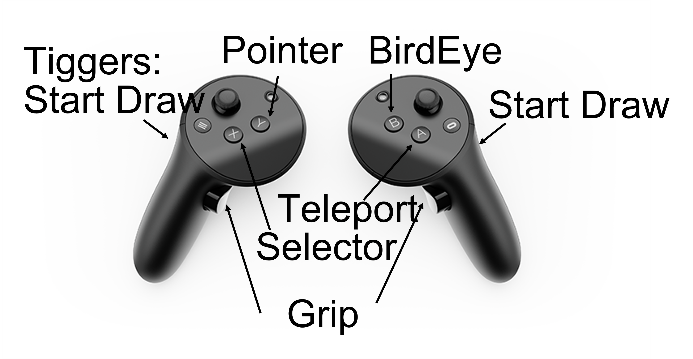

# AMixedRealityTour
Our project allows users to explore cultural heritage sites in real-time through an asymmetric system that allows those in-person (AR) to share experiences with those far away (VR).  This project leverages Ubiq and Google's Geospatial Creator to create an immersive experience that bridges the past and present.

## Getting Started

These instructions will get you a copy of the project up and running on your local machine for development and testing purposes.

Note that our experince has two parts: a AR user and a VR user collaborating at the same (real/virtual) environment. At the moment we hardcoded area near Euston Tap (London, UK) for this demo. If you would like to try it out yourself, you will need to adapt the origin of lattitude and longtitude to your own location, see instructions below.

### Prerequisites
Unity (Tested under Version 2021.3.24)
Android Phone supporting ARCore (tested on Pixel 6)
Meta Quest (tested on Quest2/3 and Pro)
Stable Internet connection(especially for video and audio streaming throuhg Ubiq)


### Installation
Clone the repo:
1. Clone the repo:
   ```sh
   git clone https://github.com/Dkaka/AMixedRealityTour.git
2. Open individual folders from Unity Hub, individually for VR and AR:

    #### VR setup:
    Follow the tutorial from Meta to setup Unity development envrionment:

    https://developer.oculus.com/documentation/unity/unity-tutorial-hello-vr/


    And compile the project to a Quest Device. (QuestLink should work as well.)


    #### AR setup:

    Follow the tutorial from Goolge Geospatial Creator Quick Start to setup for Android:

    https://developers.google.com/ar/geospatialcreator/unity/quickstart


### Deployment
The scene file for AR and VR project are located at `Assets/Scenes/Start Here.unity`

For VR, the scene file is located at   `Assets/Ubiq/Assets/Samples/Start Here.unity`

You will need your own Cesium ion api key on for loading VR 3D model Tiles. 

Start Here-> CesiumGeoreference -> Google PhotoRealistic 3D Tiles -> Cesium 3D Tileset->ion Access Token

Detials for gettign the token: https://ion.cesium.com/signin/tokens

For AR localizaiton and accessing Maps, you will need a Google Spatial service API.

You will also need Google Map Tiles API and ARCore Geospatial API. They need to be in your apk so that your phone can load the cloud service.

https://developers.google.com/ar/geospatialcreator/unity/quickstart

#### Unity setup:

- VR: Change the longtitude and lattitude origin value of `CesiumGeoreference` property to your local position.

- AR: Change the longtitude and lattitude origin value of `ARGeospatialCreatorOrigin` property to your local position.

- Make sure the two local position are exactly the same, as well as the local unity transform for the local assests, such as the Arch.

### Usage

1. Launch AR and VR app on individual devices.
2. On the AR device, Click "Join Room" to connect to the VR user through the Ubiq server.
3. Wait for google VPS to localise.

4. Once tracking is successfully localised, click on Anchor1-0 button to align coordinate frame with the VR user.
5. Look around！ You should be able to see each other now!

#### Interaction
###### VR
- Button A: Teleport to the point of the ray intersection. Green ray indicates teleportable and red ray indicates un-teleporable.
- Button B: Switch between bird-eye view and ground view with smooth position transition. AR user location will be highlighted while VR user on the sky.
- Button X: Toggle menu for asset selection for 3D pen, Video and image which is attached on the left wrist.
- Button Y: Press for ray pointer indicating point of interest.
- Grip: Grab objects for manipulation.
- Trigger: Toggle 3D pen stroke.
- Joystick: Left for view change and Right for horizontal movement.



###### AR 

- Use PenToggle Button to spawn and a pen object, requried before adding strokes.
- Use Stroke button to start and stop drawing. Grab and swing the phone as 3D pen!


### Acknowledgments

Google Geospatial Creator 
Cesium
Ubiq
